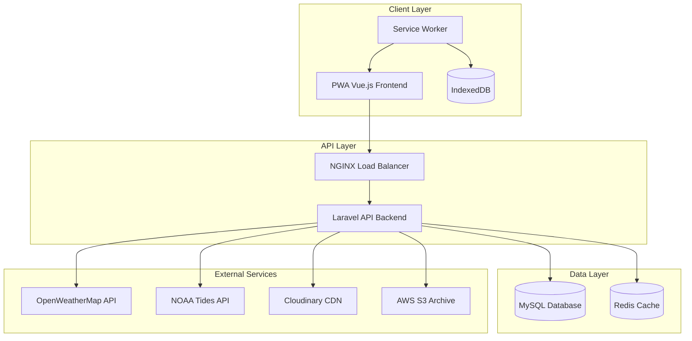
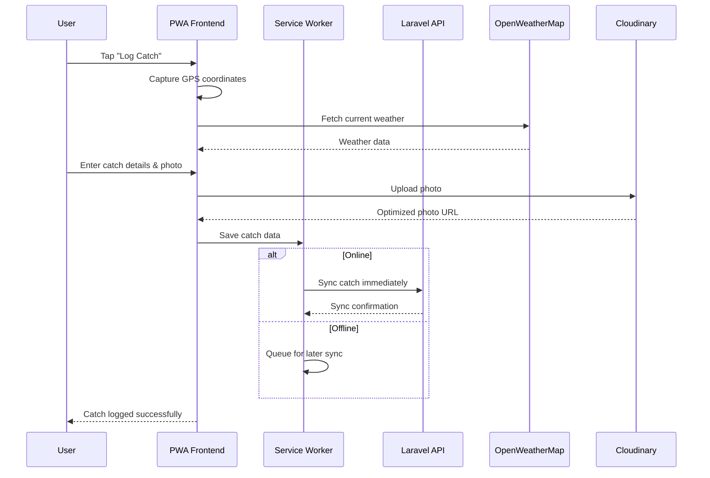
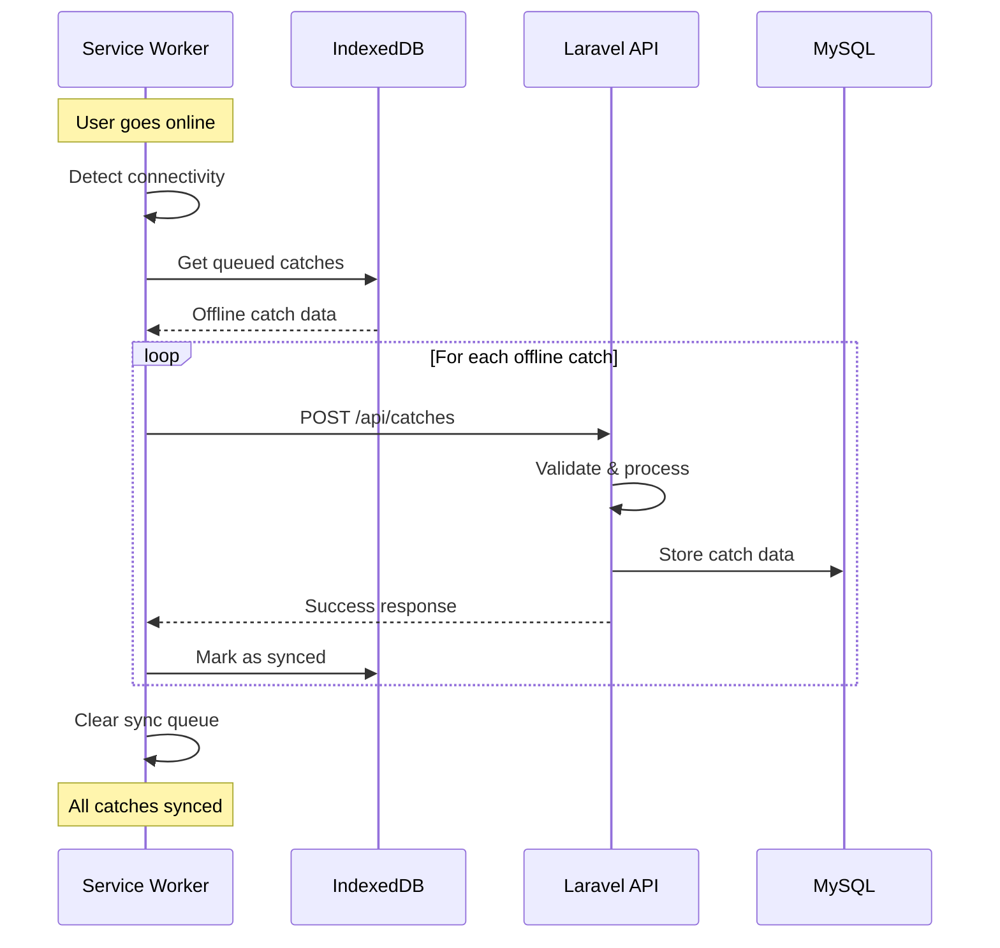

# ADR: AnglerHub Solo Angler MVP Architecture

## Executive Summary

This ADR defines the technical architecture for AnglerHub Solo Angler MVP, a mobile-first Progressive Web Application (PWA) built with Laravel backend and Vue.js frontend. The architecture prioritizes offline-first catch logging, cost-effective operations under $20K budget, and 6-week delivery timeline while serving 200-1000 solo anglers.

## Context & Constraints

### Requirements Alignment
- **10 Acceptance Criteria (AC-1 through AC-10)** covering registration, catch logging, history, statistics, goals, weather, export, mobile responsiveness, offline functionality, and security
- **5 Acceptance Examples (EX-1 through EX-5)** demonstrating key user journeys
- **Budget Constraint:** Maximum $20,000 for MVP development and first year operations
- **Timeline Constraint:** Solo angler MVP launch within 6 weeks
- **Technology Constraint:** PHP/Laravel backend, modern JavaScript frontend preferred
- **Scale Constraint:** 100+ concurrent users, 200-1000 users within 6 months

### Research Foundation
Based on approved research briefs covering weather API integration, mobile catch logging, photo storage, species database, authentication & privacy, offline sync, goal tracking, and competitive analysis.

## Architecture Decision

### Chosen Architecture: Progressive Web App (PWA)

**Core Stack:**
- **Backend:** Laravel 10+ (PHP 8.x)
- **Frontend:** Vue.js 3 + Nuxt.js (PWA mode)
- **Database:** MySQL 8.0 with spatial extensions for GPS data
- **Authentication:** Laravel Sanctum with JWT tokens
- **Testing:** Pest (PHP), Vitest (JavaScript), Playwright (E2E)

**Key Services:**
- **Weather:** OpenWeatherMap (free tier) + NOAA (free government API)
- **Photo Storage:** Cloudinary (free tier) + AWS S3 (archival after 30 days)
- **Species Database:** Static North American fish database (curated CSV/JSON)
- **Offline Storage:** IndexedDB via Service Workers
- **Deployment:** Cloud hosting (AWS/DigitalOcean) with CDN

## System Architecture

### High-Level Architecture Diagram



### Key User Flows

#### Catch Logging Flow (EX-2)


#### Offline Sync Flow (AC-9)


## Component Architecture

### Laravel Backend Structure

```
app/
├── Http/Controllers/
│   ├── Auth/
│   │   ├── RegisterController.php          # AC-1 Registration
│   │   └── LoginController.php             # AC-10 Authentication
│   ├── CatchController.php                 # AC-2 Catch logging
│   ├── CatchHistoryController.php          # AC-3 History & search
│   ├── StatisticsController.php            # AC-4 Statistics
│   ├── GoalController.php                  # AC-5 Goal tracking
│   ├── WeatherController.php               # AC-6 Weather integration
│   └── ExportController.php                # AC-7 Data export
├── Models/
│   ├── User.php
│   ├── Catch.php
│   ├── CatchPhoto.php
│   ├── Goal.php
│   └── Species.php
├── Services/
│   ├── WeatherService.php                  # OpenWeatherMap + NOAA
│   ├── PhotoStorageService.php             # Cloudinary + S3 hybrid
│   ├── SpeciesService.php                  # Static species database
│   ├── StatisticsService.php               # Analytics calculations
│   └── ExportService.php                   # CSV/JSON export
└── Jobs/
    ├── ProcessCatchPhoto.php               # Async photo processing
    ├── SyncOfflineCatch.php                # Offline data sync
    └── ArchiveOldPhotos.php                # S3 archival automation
```

### Vue.js PWA Frontend Structure

```
frontend/
├── components/
│   ├── catch/
│   │   ├── CatchLogForm.vue                # AC-2 Mobile catch logging
│   │   ├── CatchHistoryList.vue            # AC-3 History display
│   │   ├── CatchFilters.vue                # AC-3 Search filters
│   │   └── CatchPhotoCapture.vue           # Camera integration
│   ├── goals/
│   │   ├── GoalTracker.vue                 # AC-5 Goal progress
│   │   └── GoalCreationForm.vue            # AC-5 Goal creation
│   ├── weather/
│   │   └── WeatherWidget.vue               # AC-6 Weather display
│   └── common/
│       ├── OfflineIndicator.vue            # AC-9 Offline status
│       └── ResponsiveLayout.vue            # AC-8 Mobile layout
├── pages/
│   ├── auth/
│   │   └── register.vue                    # EX-1 Registration flow
│   ├── catches/
│   │   ├── log.vue                         # EX-2 Catch logging
│   │   └── history.vue                     # EX-3 History view
│   ├── goals/
│   │   └── index.vue                       # EX-4 Goal management
│   └── weather/
│       └── index.vue                       # EX-5 Weather planning
├── composables/
│   ├── useOfflineSync.ts                   # AC-9 Offline functionality
│   ├── useGeolocation.ts                   # GPS integration
│   ├── useCamera.ts                        # Photo capture
│   └── useWeather.ts                       # Weather API integration
└── plugins/
    ├── pwa.client.ts                       # Service worker setup
    └── indexeddb.client.ts                 # Offline storage
```

## Database Schema

### Core Tables

```sql
-- Users table (AC-1, AC-10)
CREATE TABLE users (
    id BIGINT PRIMARY KEY AUTO_INCREMENT,
    name VARCHAR(255) NOT NULL,
    email VARCHAR(255) UNIQUE NOT NULL,
    email_verified_at TIMESTAMP NULL,
    password VARCHAR(255) NOT NULL,
    fishing_experience ENUM('beginner', 'intermediate', 'advanced'),
    preferred_species JSON,
    privacy_settings JSON,
    created_at TIMESTAMP DEFAULT CURRENT_TIMESTAMP,
    updated_at TIMESTAMP DEFAULT CURRENT_TIMESTAMP ON UPDATE CURRENT_TIMESTAMP
);

-- Catches table (AC-2, AC-3)
CREATE TABLE catches (
    id BIGINT PRIMARY KEY AUTO_INCREMENT,
    user_id BIGINT NOT NULL,
    species VARCHAR(100) NOT NULL,
    weight DECIMAL(5,2) NULL,
    length DECIMAL(5,2) NULL,
    location_latitude DECIMAL(10,8) NOT NULL,
    location_longitude DECIMAL(11,8) NOT NULL,
    location_name VARCHAR(255) NULL,
    weather_data JSON NOT NULL,
    bait_method VARCHAR(100) NULL,
    notes TEXT NULL,
    caught_at TIMESTAMP NOT NULL,
    created_at TIMESTAMP DEFAULT CURRENT_TIMESTAMP,
    updated_at TIMESTAMP DEFAULT CURRENT_TIMESTAMP ON UPDATE CURRENT_TIMESTAMP,
    synced_at TIMESTAMP NULL,
    client_uuid VARCHAR(36) NULL,
    
    FOREIGN KEY (user_id) REFERENCES users(id) ON DELETE CASCADE,
    SPATIAL INDEX location_idx (POINT(location_longitude, location_latitude))
);

-- Catch photos table (AC-2)
CREATE TABLE catch_photos (
    id BIGINT PRIMARY KEY AUTO_INCREMENT,
    catch_id BIGINT NOT NULL,
    cloudinary_public_id VARCHAR(255) NULL,
    s3_key VARCHAR(255) NULL,
    original_filename VARCHAR(255),
    file_size INTEGER,
    width INTEGER,
    height INTEGER,
    metadata JSON,
    storage_tier ENUM('cloudinary', 's3_archive') DEFAULT 'cloudinary',
    uploaded_at TIMESTAMP DEFAULT CURRENT_TIMESTAMP,
    archived_at TIMESTAMP NULL,
    created_at TIMESTAMP DEFAULT CURRENT_TIMESTAMP,
    
    FOREIGN KEY (catch_id) REFERENCES catches(id) ON DELETE CASCADE
);

-- Goals table (AC-5)
CREATE TABLE goals (
    id BIGINT PRIMARY KEY AUTO_INCREMENT,
    user_id BIGINT NOT NULL,
    title VARCHAR(255) NOT NULL,
    description TEXT,
    goal_type ENUM('species_count', 'total_catches', 'size_target', 'species_diversity'),
    target_value INTEGER NOT NULL,
    current_value INTEGER DEFAULT 0,
    deadline DATE NULL,
    status ENUM('active', 'completed', 'abandoned') DEFAULT 'active',
    created_at TIMESTAMP DEFAULT CURRENT_TIMESTAMP,
    updated_at TIMESTAMP DEFAULT CURRENT_TIMESTAMP ON UPDATE CURRENT_TIMESTAMP,
    
    FOREIGN KEY (user_id) REFERENCES users(id) ON DELETE CASCADE
);

-- Species lookup table (static data)
CREATE TABLE species (
    id INTEGER PRIMARY KEY AUTO_INCREMENT,
    common_name VARCHAR(100) NOT NULL,
    scientific_name VARCHAR(100),
    family VARCHAR(100),
    habitat VARCHAR(100),
    region VARCHAR(100),
    typical_size_min DECIMAL(5,2),
    typical_size_max DECIMAL(5,2),
    
    INDEX common_name_idx (common_name),
    INDEX family_idx (family),
    INDEX region_idx (region)
);
```

## File-Change Plan

### Phase 1: Laravel Backend Foundation (Week 1-2)

**New Files to Create:**
1. **Database Migrations:**
   - `/database/migrations/2024_01_01_000000_create_catches_table.php`
   - `/database/migrations/2024_01_01_000001_create_catch_photos_table.php`
   - `/database/migrations/2024_01_01_000002_create_goals_table.php`
   - `/database/migrations/2024_01_01_000003_create_species_table.php`

2. **Models:**
   - `/app/Models/Catch.php` (AC-2, AC-3 functionality)
   - `/app/Models/CatchPhoto.php` (photo storage integration)
   - `/app/Models/Goal.php` (AC-5 goal tracking)
   - `/app/Models/Species.php` (species lookup)

3. **Controllers:**
   - `/app/Http/Controllers/API/CatchController.php` (AC-2 logging, AC-3 history)
   - `/app/Http/Controllers/API/GoalController.php` (AC-5 goal management)
   - `/app/Http/Controllers/API/WeatherController.php` (AC-6 weather integration)
   - `/app/Http/Controllers/API/StatisticsController.php` (AC-4 analytics)
   - `/app/Http/Controllers/API/ExportController.php` (AC-7 data export)

4. **Services:**
   - `/app/Services/WeatherService.php` (OpenWeatherMap + NOAA integration)
   - `/app/Services/PhotoStorageService.php` (Cloudinary + S3 hybrid)
   - `/app/Services/SpeciesService.php` (static species database)
   - `/app/Services/StatisticsService.php` (AC-4 calculations)
   - `/app/Services/ExportService.php` (CSV/JSON export logic)

5. **Jobs:**
   - `/app/Jobs/ProcessCatchPhoto.php` (async photo processing)
   - `/app/Jobs/SyncOfflineCatch.php` (offline data reconciliation)
   - `/app/Jobs/ArchiveOldPhotos.php` (S3 lifecycle management)

**Files to Modify:**
1. **Configuration:**
   - `/config/sanctum.php` (AC-10 authentication setup)
   - `/config/services.php` (add OpenWeatherMap, Cloudinary, S3 credentials)
   - `/config/queue.php` (async job processing)

2. **Routes:**
   - `/routes/api.php` (API endpoints for all ACs)

3. **User Model:**
   - `/app/Models/User.php` (add fishing preferences, privacy settings for AC-1, AC-10)

### Phase 2: Vue.js PWA Frontend (Week 3-4)

**New Files to Create:**
1. **PWA Configuration:**
   - `/frontend/nuxt.config.ts` (PWA module configuration)
   - `/frontend/static/sw.js` (custom service worker for offline functionality)
   - `/frontend/static/manifest.json` (PWA manifest)

2. **Pages:**
   - `/frontend/pages/auth/register.vue` (EX-1 registration flow)
   - `/frontend/pages/catches/log.vue` (EX-2 mobile catch logging)
   - `/frontend/pages/catches/history.vue` (EX-3 history and search)
   - `/frontend/pages/goals/index.vue` (EX-4 goal management)
   - `/frontend/pages/weather/index.vue` (EX-5 weather planning)
   - `/frontend/pages/statistics/index.vue` (AC-4 analytics dashboard)

3. **Components:**
   - `/frontend/components/catch/CatchLogForm.vue` (mobile-optimized catch entry)
   - `/frontend/components/catch/CatchHistoryList.vue` (history display with filtering)
   - `/frontend/components/catch/CatchFilters.vue` (AC-3 search functionality)
   - `/frontend/components/catch/CatchPhotoCapture.vue` (camera integration)
   - `/frontend/components/goals/GoalTracker.vue` (AC-5 progress display)
   - `/frontend/components/goals/GoalCreationForm.vue` (goal setup)
   - `/frontend/components/weather/WeatherWidget.vue` (AC-6 weather display)
   - `/frontend/components/common/OfflineIndicator.vue` (AC-9 status indicator)
   - `/frontend/components/common/ResponsiveLayout.vue` (AC-8 mobile layout)

4. **Composables:**
   - `/frontend/composables/useOfflineSync.ts` (AC-9 offline functionality)
   - `/frontend/composables/useGeolocation.ts` (GPS integration)
   - `/frontend/composables/useCamera.ts` (photo capture logic)
   - `/frontend/composables/useWeather.ts` (weather API integration)
   - `/frontend/composables/useStatistics.ts` (AC-4 analytics calculations)

5. **Plugins:**
   - `/frontend/plugins/pwa.client.ts` (service worker registration)
   - `/frontend/plugins/indexeddb.client.ts` (offline storage setup)
   - `/frontend/plugins/sanctum.client.ts` (AC-10 authentication)

### Phase 3: Testing & Integration (Week 5-6)

**New Files to Create:**
1. **PHP Tests:**
   - `/tests/Feature/CatchLoggingTest.php` (AC-2 comprehensive testing)
   - `/tests/Feature/CatchHistoryTest.php` (AC-3 history and search)
   - `/tests/Feature/GoalTrackingTest.php` (AC-5 goal functionality)
   - `/tests/Feature/WeatherIntegrationTest.php` (AC-6 weather APIs)
   - `/tests/Feature/StatisticsTest.php` (AC-4 analytics)
   - `/tests/Feature/DataExportTest.php` (AC-7 export functionality)
   - `/tests/Feature/AuthenticationTest.php` (AC-10 security)
   - `/tests/Unit/WeatherServiceTest.php` (weather service logic)
   - `/tests/Unit/PhotoUploadTest.php` (photo processing)
   - `/tests/Unit/StatisticsCalculatorTest.php` (analytics calculations)
   - `/tests/Integration/OpenWeatherMapTest.php` (external API testing)
   - `/tests/Integration/NOAATest.php` (tide data integration)
   - `/tests/Integration/OfflineCatchSyncTest.php` (AC-9 sync logic)

2. **JavaScript Tests:**
   - `/frontend/tests/components/CatchLogForm.test.ts` (mobile catch logging)
   - `/frontend/tests/composables/useOfflineSync.test.ts` (offline functionality)
   - `/frontend/tests/e2e/user-registration-flow.spec.ts` (EX-1 end-to-end)
   - `/frontend/tests/e2e/mobile-catch-logging-flow.spec.ts` (EX-2 end-to-end)
   - `/frontend/tests/e2e/catch-history-flow.spec.ts` (EX-3 end-to-end)
   - `/frontend/tests/e2e/goal-creation-flow.spec.ts` (EX-4 end-to-end)
   - `/frontend/tests/e2e/weather-check-flow.spec.ts` (EX-5 end-to-end)
   - `/frontend/tests/pwa/offline-storage.spec.ts` (AC-9 PWA testing)
   - `/frontend/tests/pwa/service-worker.spec.ts` (offline service worker)

**Files to Modify:**
1. **Configuration:**
   - `/phpunit.xml` (test configuration for Laravel)
   - `/frontend/vitest.config.ts` (JavaScript unit testing)
   - `/frontend/playwright.config.ts` (E2E test configuration)

## Test Strategy

### Testing Pyramid Approach

**Unit Tests (70% coverage):**
- Laravel backend services and models
- Vue.js components and composables
- Utility functions and calculations
- Data validation and transformation logic

**Integration Tests (20% coverage):**
- External API integrations (OpenWeatherMap, NOAA, Cloudinary)
- Database operations and data consistency
- Authentication and authorization flows
- Offline sync and conflict resolution

**End-to-End Tests (10% coverage):**
- Critical user journeys (5 acceptance examples)
- Mobile responsiveness across devices
- PWA functionality (offline, installation, notifications)
- Cross-browser compatibility

### AC/Example to Test Mapping

Each Acceptance Criteria and Example maps to specific test categories:

**AC-1 (Registration)** → Feature/Unit/E2E tests for user registration flow
**AC-2 (Catch Logging)** → Feature/Unit/Integration/E2E tests for core logging functionality
**AC-3 (History & Search)** → Feature/Unit/E2E tests for data retrieval and filtering
**AC-4 (Statistics)** → Feature/Unit tests for analytics calculations
**AC-5 (Goal Tracking)** → Feature/Unit/E2E tests for goal management
**AC-6 (Weather Integration)** → Feature/Integration/E2E tests for weather APIs
**AC-7 (Data Export)** → Feature/Unit tests for export functionality
**AC-8 (Mobile Responsive)** → E2E/PWA tests for mobile optimization
**AC-9 (Offline Functionality)** → Integration/PWA tests for offline capabilities
**AC-10 (Security & Privacy)** → Feature/Unit/Security tests for authentication and data protection

### Testing Tools & Framework

- **PHP Testing:** Pest framework for Laravel backend
- **JavaScript Testing:** Vitest for unit/component tests
- **E2E Testing:** Playwright for cross-browser automation
- **PWA Testing:** Workbox testing utilities for service worker validation
- **API Testing:** Laravel HTTP tests for API endpoints
- **Performance Testing:** Lighthouse CI for PWA performance validation

## Security & Privacy Implementation

### Authentication & Authorization (AC-10)
- **Laravel Sanctum:** Stateless API authentication with JWT tokens
- **Password Policy:** Minimum 8 characters, mixed case, numbers
- **Session Management:** Secure token storage with httpOnly cookies
- **Rate Limiting:** Prevent brute force and API abuse

### Data Privacy Controls
- **GPS Generalization:** Optional 1-mile radius location privacy
- **EXIF Stripping:** Remove camera metadata from photos
- **Data Encryption:** AES-256 encryption for sensitive data at rest
- **User Data Deletion:** Complete data removal within 30 days of account deletion

### API Security
- **CSRF Protection:** Laravel built-in CSRF validation
- **Input Validation:** Strict validation rules for all user inputs
- **SQL Injection Prevention:** Eloquent ORM with parameterized queries
- **XSS Protection:** Vue.js automatic output escaping

## Performance & Scalability

### Backend Optimization
- **Database Indexing:** Optimized indexes for GPS queries and filtering
- **Redis Caching:** Cache weather data, statistics, and frequently accessed data
- **Queue Processing:** Async jobs for photo processing and data synchronization
- **API Rate Limiting:** Prevent API abuse and ensure fair usage

### Frontend Performance
- **Code Splitting:** Lazy loading of non-critical components
- **Image Optimization:** Automatic compression and format selection via Cloudinary
- **Service Worker Caching:** Aggressive caching for app shell and static assets
- **Progressive Loading:** Skeleton screens and incremental content loading

### Cost Optimization
- **Weather APIs:** Free tiers with intelligent caching to minimize calls
- **Photo Storage:** Hybrid Cloudinary/S3 approach with 30-day archival
- **Database Optimization:** Efficient queries and proper indexing
- **CDN Usage:** Leverage free CDN tiers for static asset delivery

## Monitoring & Observability

### Application Monitoring
- **Laravel Horizon:** Queue monitoring and job processing insights
- **Error Tracking:** Comprehensive error logging and alerting
- **Performance Metrics:** API response times and database query performance
- **User Analytics:** Track feature usage and user engagement patterns

### Cost Monitoring
- **API Usage Tracking:** Monitor weather API calls against free tier limits
- **Storage Cost Alerts:** Track photo storage costs and usage patterns
- **Infrastructure Monitoring:** Server resource usage and optimization opportunities

## Deployment Strategy

### Infrastructure
- **Cloud Hosting:** AWS EC2 or DigitalOcean for Laravel backend
- **Database:** Managed MySQL service for reliability and backups
- **CDN:** CloudFlare free tier for static asset delivery and DDoS protection
- **SSL/TLS:** Free SSL certificates via Let's Encrypt

### CI/CD Pipeline
- **Automated Testing:** Run full test suite on every commit
- **Code Quality:** PHP-CS-Fixer and ESLint for code standards
- **Deployment:** Blue-green deployment strategy for zero downtime
- **Database Migrations:** Automated and reversible database changes

## Risk Mitigation

### Technical Risks
- **Weather API Limits:** Aggressive caching and fallback to cached data
- **Photo Storage Costs:** Automated S3 archival and compression optimization
- **Offline Sync Conflicts:** Robust conflict resolution with user notifications
- **PWA Browser Support:** Progressive enhancement with graceful degradation

### Operational Risks
- **Budget Overrun:** Daily cost monitoring with automated alerts at 80% thresholds
- **Timeline Delays:** Phased delivery with MVP core features prioritized
- **User Adoption:** Focus on mobile-first design and offline-first functionality

## Success Metrics

### Technical Metrics
- **Performance:** <2s page load times, <1s API response times
- **Reliability:** 99%+ uptime, <0.1% error rate
- **Mobile:** 95%+ mobile traffic successfully served
- **Offline:** 100% of catch logging functions work offline

### Business Metrics
- **User Engagement:** 70%+ users log catches monthly
- **Feature Adoption:** 80%+ users use mobile catch logging
- **Cost Efficiency:** Stay within $50/month operational budget
- **User Satisfaction:** >85% user satisfaction in post-launch feedback

## Next Steps for Implementation

1. **Week 1:** Set up Laravel project, database schema, and basic API endpoints
2. **Week 2:** Implement weather integration, photo storage, and core catch logging
3. **Week 3:** Build Vue.js PWA frontend with mobile-optimized components
4. **Week 4:** Implement offline functionality, service workers, and data synchronization
5. **Week 5:** Comprehensive testing, performance optimization, and security hardening
6. **Week 6:** Deployment, monitoring setup, and final user acceptance testing

This architecture provides a solid foundation for the AnglerHub Solo Angler MVP that can be delivered within the 6-week timeline and $20K budget while meeting all acceptance criteria and providing a strong base for future club management features.